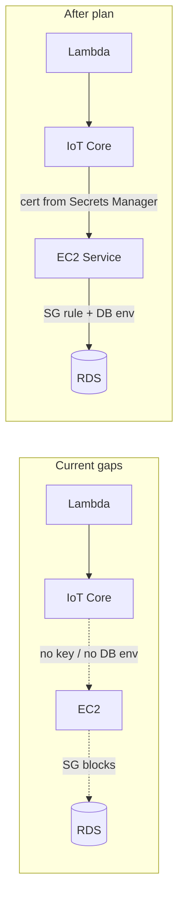

# Plan: Full AWS Data Pipeline to 100%

## Current state (approx. 80%)

- Lambda generator: deployed, publishing to IoT Core every 1 minute.
- EventBridge, IoT Core (thing, certificate, policy): configured.
- EC2 instance: may exist (per [DEPLOYMENT_COMPLETE.md](DEPLOYMENT_COMPLETE.md)) but service deployment and data flow are unverified.
- RDS: exists; secret holds `username`, `password`, `host`, `port`, `database`.
- Gaps: EC2 cannot reach RDS (SG); EC2 has no IoT private key; EC2 service has no DB env vars; application code/start path may be wrong.

## Target state

End-to-end flow working: **EventBridge** triggers **Lambda** → **Lambda** publishes to **IoT Core** → **EC2** subscribes and runs **mqtt-to-rds-service** → service writes to **RDS** → **Grafana** (or any client) can query RDS and show data.

---

## 1. Allow EC2 to reach RDS (security group)

**Issue**: [infrastructure/modules/vpc/main.tf](infrastructure/modules/vpc/main.tf) defines the RDS security group with ingress only from the **Lambda** security group (lines 108–113). There is no ingress from the EC2 MQTT ingest security group, so EC2 cannot connect to RDS on 5432.

**Change**: In [infrastructure/main.tf](infrastructure/main.tf), add an `aws_security_group_rule` resource that allows ingress to the RDS security group from the EC2 security group on port 5432 (TCP). Use `module.vpc.rds_security_group_id` and `module.ec2.security_group_id` (EC2 module already exposes `security_group_id` in [infrastructure/modules/ec2/main.tf](infrastructure/modules/ec2/main.tf)).

**Result**: EC2 instances using the MQTT ingest security group can connect to RDS.

---

## 2. Provide EC2 with the IoT private key

**Issue**: The EC2 user-data script uses `aws iot describe-certificate` to fetch the certificate PEM. AWS does **not** return the private key from `describe-certificate`; the private key is only available at certificate creation time. Terraform holds it in state ([infrastructure/modules/iot/main.tf](infrastructure/modules/iot/main.tf) outputs `ec2_private_key`). So EC2 currently cannot obtain the private key, and the MQTT client will fail TLS client auth.

**Change**:

- **Terraform**: In the IoT module (or a small separate resource in main), create an AWS Secrets Manager secret (e.g. `{name_prefix}/ec2-iot-cert`) and store the EC2 certificate PEM and private key (from `aws_iot_certificate.ec2_ingest`) in a single secret (e.g. JSON: `{ certificatePem, privateKey }`). Ensure the EC2 IAM role has `secretsmanager:GetSecretValue` on this secret (e.g. extend [infrastructure/modules/ec2/main.tf](infrastructure/modules/ec2/main.tf) policy to include this secret ARN or a pattern that matches it).
- **User-data**: In [infrastructure/modules/ec2/user-data.sh](infrastructure/modules/ec2/user-data.sh), instead of (or in addition to) `describe-certificate` for the PEM, fetch the new secret from Secrets Manager, parse JSON, and write `certificatePem` to `/opt/scada/certs/certificate.pem.crt` and `privateKey` to `/opt/scada/certs/private.pem.key`. Pass the secret ARN into user-data via Terraform `templatefile` (e.g. new variable `ec2_iot_secret_arn`).

**Result**: EC2 has both certificate and private key and can authenticate to IoT Core over MQTT.

---

## 3. Pass RDS credentials into the EC2 service

**Issue**: User-data fetches the RDS secret to `/tmp/db-secret.json` but does not expose its contents to the systemd service. [src/database/connection.ts](src/database/connection.ts) (and [src/utils/config.ts](src/utils/config.ts)) read `DB_HOST`, `DB_PORT`, `DB_NAME`, `DB_USER`, `DB_PASSWORD` from the environment. So the running process has no DB config and cannot connect to RDS.

**Change**: In [infrastructure/modules/ec2/user-data.sh](infrastructure/modules/ec2/user-data.sh), after fetching the RDS secret into `/tmp/db-secret.json`, parse it (e.g. with `jq`) and inject `Environment=DB_HOST=...`, `Environment=DB_PORT=...`, `Environment=DB_NAME=...`, `Environment=DB_USER=...`, `Environment=DB_PASSWORD=...` into the systemd unit (the `cat > /etc/systemd/system/scada-mqtt-ingest.service <<EOF` block). Ensure values are safely quoted. Alternatively, the app could be changed to read DB config from a file (e.g. `/tmp/db-secret.json`) before initializing the DB; the minimal fix is to set env in the unit from the existing secret file.

**Result**: The `scada-mqtt-ingest` service starts with correct DB_* env vars and can connect to RDS.

---

## 4. Deploy and run the correct application on EC2

**Issue**: User-data runs `node src/ec2/mqtt-to-rds-service.js`. The app is TypeScript; the built artifact is under `dist/ec2/mqtt-to-rds-service.js`. If `repo_url` is not set, user-data only creates empty dirs and no code is present. If repo is cloned, user-data does not run `npm run build`, so `dist/` may be missing.

**Change**:

- **ExecStart path**: In [infrastructure/modules/ec2/user-data.sh](infrastructure/modules/ec2/user-data.sh), set `ExecStart=/usr/bin/node dist/ec2/mqtt-to-rds-service.js` (or the path where the built file actually lives after deploy). Ensure `WorkingDirectory` is the app root (e.g. `/opt/scada`).
- **Deployment path A (recommended for automation)**: Add optional Terraform variables (e.g. `ec2_deploy_s3_bucket`, `ec2_deploy_s3_key`). If set, user-data downloads the tarball from S3, extracts to `/opt/scada`, and then starts the service. The CI/deploy pipeline (or a manual step) should build the app (`npm ci && npm run build`), create a tarball that includes `dist/`, `node_modules`, and any required files (no need for full repo), upload to S3, and optionally trigger instance refresh or a new launch. EC2 IAM role already has S3 access if you add it; otherwise add minimal S3 GetObject for the deploy bucket/key.
- **Deployment path B (repo clone)**: If `repo_url` is set, after `git clone` and `npm install --production`, run `npm run build` so `dist/` exists, then use `dist/ec2/mqtt-to-rds-service.js` in ExecStart.

**Result**: EC2 runs the built Node service that subscribes to MQTT and writes to RDS.

---

## 5. Terraform and EC2 lifecycle

- **RDS SG rule**: Adding the EC2→RDS rule in main.tf does not require recreating RDS; apply and then EC2 can connect.
- **EC2 user-data**: Changing user-data only takes effect for **new** instances. If an EC2 instance already exists, either (a) replace the instance (e.g. taint and apply, or change an attribute that forces replacement), or (b) manually update the instance: fix certs, DB env, code path, and restart the service. Document the chosen approach.
- **IoT secret**: Creating the secret and storing the key is a one-time change. New EC2 launches will use it; existing instances need manual update or replacement.
- Resolve any Terraform state or dependency issues (e.g. missing or inconsistent state for RDS/VPC/EC2) so that `terraform apply` can run cleanly for the modules you change.

---

## 6. Verification and documentation

- **Verification**: After deployment, confirm (1) Lambda is invoked and publishes to IoT (existing CloudWatch logs), (2) EC2 service is running (`systemctl status scada-mqtt-ingest`), (3) RDS has new rows in `devices`, `telemetry`, or `connections` after a few minutes, (4) Optional: Grafana (or `psql`) against RDS shows fresh data. Add a short verification section to [DEPLOYMENT_COMPLETE.md](DEPLOYMENT_COMPLETE.md) or [docs/MQTT_TO_RDS_ARCHITECTURE.md](docs/MQTT_TO_RDS_ARCHITECTURE.md) with these steps and, if useful, a small script that checks RDS row counts or latest timestamps.
- **Grafana on AWS**: If the goal is Grafana in AWS reading from RDS, that is a separate deploy (e.g. Grafana on EC2 or ECS with RDS as datasource, or managed Grafana). The pipeline is “100%” when Lambda → IoT → EC2 → RDS is proven; connecting Grafana to RDS is then configuration (same as local, but with RDS endpoint and secret).

---

## Implementation order

1. **Infrastructure (Terraform)**
  - Add RDS ingress rule from EC2 SG in main.tf.  
  - Add Secrets Manager secret for EC2 IoT cert + private key; grant EC2 role access; pass secret ARN into EC2 user-data.  
  - Update EC2 user-data to: fetch EC2 IoT cert from new secret and write cert + key; parse RDS secret and set DB_* in systemd unit; use `dist/ec2/mqtt-to-rds-service.js` and, if applicable, S3 deploy or repo + build.  
  - Add S3 permissions for EC2 deploy bucket if using S3 deploy path.
2. **Deploy**
  - Run `terraform apply`.  
  - If using S3 deploy: build app, upload tarball, then launch or replace EC2 so it runs new user-data.  
  - If using repo: set `repo_url` (and branch), then launch or replace EC2.
3. **Verification**
  - Check Lambda logs, EC2 service status, and RDS for new data; update docs with verification steps.

---

## Optional diagram

No edits to the plan file or to application logic are required beyond ensuring the service runs from the built path and has DB env (or file) and cert/key on disk.