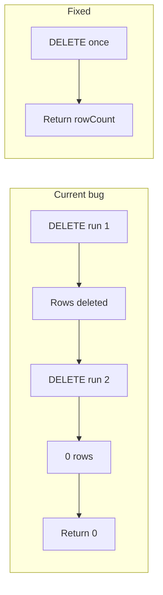

# Codebase analysis: issues and fixes

## Summary

- **Critical:** 1 bug (database `delete()`)
- **Deployment:** Lambda handler path mismatch and script/Terraform inconsistency
- **Optional:** Missing optional dependency and small alignment fixes

Your message ended with “fix it acc to the” — fixes below are proposed according to common best practices and consistency with the rest of the repo. If you had a specific standard (e.g. “according to the style guide” or “according to the plan in X”), say which and the plan can be narrowed.

---

## 1. Critical: `DatabaseConnection.delete()` runs DELETE twice and always returns 0

**Location:** [src/database/connection.ts](src/database/connection.ts) (lines 236–246)

**What’s wrong**

- The method runs the same DELETE twice: once via `this.query()` and once via `this.pool!.query()`.
- `this.query()` only returns `result.rows` (empty for DELETE), not `rowCount`.
- The second DELETE runs after rows are already removed, so it affects 0 rows and `deleteResult.rowCount` is 0.
- So **every delete is executed twice and the returned count is always 0.**

**Impact**

- `BaseRepository.delete(id)` returns `count > 0` → always **false** (e.g. device/alert “delete” appears to fail).
- `BaseRepository.deleteMany()` and any cleanup that relies on “number of rows deleted” (e.g. telemetry/alert/connection retention) see **0** instead of the real count.

**Fix**

- Run a single DELETE and return its `rowCount`.
- Ensure the pool is connected (same pattern as `query()`), then call `this.pool.query()` once and return `result.rowCount ?? 0`.
- Remove the extra `this.query()` call and the second `this.pool!.query()`.

---

## 2. Lambda handler path mismatch (Terraform vs deploy script)

**Locations**

- [infrastructure/modules/lambda/main.tf](infrastructure/modules/lambda/main.tf): handlers use `dist/lambda/ingest/handler.handler`, etc.
- [scripts/deploy-lambda.sh](scripts/deploy-lambda.sh): copies `dist/*` into the package root, so the zip has `lambda/ingest/handler.js`, **not** `dist/lambda/...`.

**What’s wrong**

- Terraform expects the handler file at `dist/lambda/.../handler` inside the zip.
- The script produces a zip where the handler file is at `lambda/.../handler`.
- If you deploy using this script, Lambda will look for `dist/lambda/ingest/handler` and fail (module not found).

**Fix (choose one)**

- **Option A (recommended):** Change Terraform handler values to match the current zip layout:  
`lambda/ingest/handler.handler`, `lambda/process/handler.handler`, `lambda/query/handler.handler`, `lambda/generator/handler.handler`.
- **Option B:** Change the script so the zip contains a `dist/` directory (e.g. `mkdir -p "$PACKAGE_DIR/dist"` and `cp -r "$DIST_DIR"/* "$PACKAGE_DIR/dist/"`) so Terraform’s `dist/lambda/...` paths are correct.

Apply the same convention for any future Lambda (e.g. export) so code and Terraform stay in sync.

---

## 3. Deploy script vs Terraform: “export” Lambda

**Locations**

- [scripts/deploy-lambda.sh](scripts/deploy-lambda.sh): `FUNCTIONS=("ingest" "process" "query" "export" "generator")`.
- [infrastructure/modules/lambda/main.tf](infrastructure/modules/lambda/main.tf): only defines ingest, process, query, generator (no export).

**What’s wrong**

- The script tries to update a function `scada-${ENVIRONMENT}-export` that Terraform never creates, so `update-function-code` will fail for “export” unless that function was created elsewhere.

**Fix**

- Either **add** an `export` Lambda in Terraform (and wire it like the others, using the same handler path convention as in section 2),  
- Or **remove** `"export"` from `FUNCTIONS` in `deploy-lambda.sh` so the script only updates the four functions that Terraform defines.

---

## 4. Optional: `modbus-serial` dependency

**Location:** [src/collectors/modbus-collector.ts](src/collectors/modbus-collector.ts) uses `require('modbus-serial')` and gracefully degrades if the package is missing.

**What’s missing**

- `modbus-serial` is not listed in [package.json](package.json). The code is written to work without it, but installs and docs are clearer if the optional dependency is declared.

**Fix**

- Add `modbus-serial` to `optionalDependencies` in `package.json` (with a version range). No code change required.

---

## 5. Other checks (no changes required)

- **Linting:** No linter errors reported under `src`, `tests`, or `infrastructure`.
- **Imports:** Database index exports `getTelemetryRepository`; ingest handler and others import correctly.
- **Env/config:** Generator and EC2 MQTT service validate `IOT_ENDPOINT` and throw; config uses Zod with sensible defaults.
- **ESLint:** Uses `sourceType: "module"` while tsconfig uses `"module": "commonjs"`; lint only runs on `src/**/*.ts`, so this is a minor config nuance, not a blocking error.

---

## Recommended order of work

1. Fix **database `delete()**` (critical for correct delete behavior and retention logic).
2. Align **Lambda handler paths** and **export** (script vs Terraform) so deployments work and match infra.
3. Optionally add **modbus-serial** to `optionalDependencies`.

No other functional bugs or errors were found in the analyzed code paths; the only blocking issue is the `delete()` implementation.