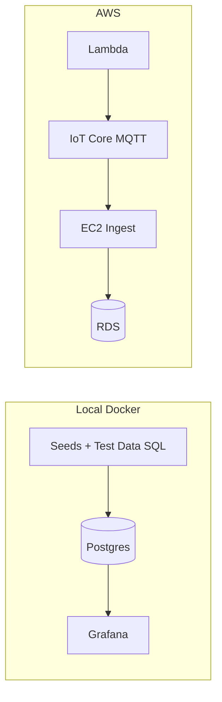

# Plan: Fix No Data in 5 Grafana Dashboards

## Root cause summary

| Area              | Issue                                                                                                                                                                                                                                                                                                                                                                                                                                                                                                                                                                                                                                                                                  |
| ----------------- | -------------------------------------------------------------------------------------------------------------------------------------------------------------------------------------------------------------------------------------------------------------------------------------------------------------------------------------------------------------------------------------------------------------------------------------------------------------------------------------------------------------------------------------------------------------------------------------------------------------------------------------------------------------------------------------- |
| **Datasource**    | Dashboards expect a PostgreSQL datasource with **uid: `postgres**`. Two files exist: [grafana/datasources/datasources.yaml](grafana/datasources/datasources.yaml) (no `uid`, uses `${DB_HOST}` etc.) and [grafana/datasources/postgres.yaml](grafana/datasources/postgres.yaml) (has `uid: postgres`). Grafana container in [grafana/docker-compose.yml](grafana/docker-compose.yml) gets **no** `DB_*` or `DB_PASSWORD` env vars, so provisioned datasource may have wrong URL or empty password.                                                                                                                                                                                     |
| **Database**      | Local stack has no data pipeline (Lambda/MQTT is AWS-only). Postgres is created from [database/migrations](database/migrations) only; [database/seeds/purdue-zones.sql](database/seeds/purdue-zones.sql) is **not** in `docker-entrypoint-initdb.d`, so `security_zones` and `firewall_rules` are empty. Without running test data or seeds, `devices`, `connections`, `alerts`, `risk_assessments` are empty.                                                                                                                                                                                                                                                                         |
| **Dashboard SQL** | [zone-overview](grafana/dashboards/zone-overview.json) and [risk-heatmap](grafana/dashboards/risk-heatmap.json) use `**security_zones.zone_id**` and joins like `**d.security_zone = sz.zone_id**`. The schema has `**security_zones.id**` (UUID) and `**devices.security_zone**` (enum: `process`, `control`, …). So those queries are invalid. [realtime-topology](grafana/dashboards/realtime-topology.json) uses `**a.type IN ('device_discovered', 'device_removed', ...)**` but [alert_type](database/migrations/005_create_alerts_table.sql) enum is only `**'security', 'connectivity', 'compliance', 'performance', 'configuration'**` — so that panel can never return rows. |
| **Test data**     | [scripts/phase2-test-data.sql](scripts/phase2-test-data.sql) uses invalid enum values (e.g. `security_zone` like `'L0-ICS'`, `alert_type` like `'unauthorized_access'`) and references non-existent columns (e.g. `alerts.updated_at`), so it fails if run as-is.                                                                                                                                                                                                                                                                                                                                                                                                                      |

---

## 1. Ensure one working PostgreSQL datasource with uid `postgres`

- **Option A (recommended for local Docker):** Use a single provisioned datasource that matches the dashboards.
  - In [grafana/docker-compose.yml](grafana/docker-compose.yml), add env vars for Grafana so the datasource can connect to the `postgres` service, e.g.:
    - `DB_HOST=postgres`, `DB_PORT=5432`, `DB_NAME=scada_topology`, `DB_USER=scada_admin`, `DB_PASSWORD=${DB_PASSWORD:-scada_password}`
  - In [grafana/datasources](grafana/datasources): either remove or rename the file that does **not** set `uid: postgres` so only one YAML provisions the Postgres datasource with **uid: `postgres**` and the same connection details (host `postgres`, port 5432, database `scada_topology`, user `scada_admin`, password from env). Ensure the chosen file uses Grafana env substitution (e.g. `password: ${DB_PASSWORD}`) and that `DB_PASSWORD` is set for the Grafana container (as above).
- **Option B:** If you keep two files, ensure the one that defines **uid: `postgres**` is the one that points to the running Postgres (e.g. `postgres:5432` in Docker) and receives the correct password via env. Then fix Grafana env so `DB_PASSWORD` (and any other needed vars) are passed into the Grafana service.

**Verification:** In Grafana UI, Configuration → Data sources → PostgreSQL has uid `postgres` and “Save & test” succeeds.

---

## 2. Align dashboard queries with actual schema

- **security_zones:** Table has `id` (UUID), not `zone_id`. `devices.security_zone` is an enum (`process`, `control`, …), not a UUID.
  - **Zone Overview** (and any panel joining zones): Use `**fr.source_zone_id = src_zone.id**` and `**fr.destination_zone_id = dst_zone.id**` (replace `zone_id` with `id`).
  - For **devices ↔ security_zones**: Join on `**d.security_zone = sz.zone_type**` (e.g. `LEFT JOIN security_zones sz ON d.security_zone = sz.zone_type`), not on a non-existent `zone_id`.
- **Realtime Topology – “Alerts over time” panel:** The filter `**a.type IN ('device_discovered', 'device_removed', 'connection_added', 'connection_removed')**` does not match the current `alert_type` enum. Either:
  - Change the panel query to use the existing enum values (e.g. `type IN ('security', 'connectivity', 'compliance', 'performance', 'configuration')` or a subset), or
  - Extend the `alert_type` enum in the DB and in any app code that writes alerts to include those types, then keep the panel as-is.

Apply these changes in the JSON for [zone-overview.json](grafana/dashboards/zone-overview.json), [risk-heatmap.json](grafana/dashboards/risk-heatmap.json), and [realtime-topology.json](grafana/dashboards/realtime-topology.json) as needed.

---

## 3. Seed the database so dashboards have data

- **Zones and firewall rules:** Run [database/seeds/purdue-zones.sql](database/seeds/purdue-zones.sql) once against the Postgres used by Grafana (e.g. `psql -h localhost -U scada_admin -d scada_topology -f database/seeds/purdue-zones.sql`), or add this seed to a documented init step (e.g. after migrations in [scripts/run-migrations.sh](scripts/run-migrations.sh) or a one-off container step). This populates `security_zones` and `firewall_rules` so Zone Overview and any zone-based panels can return data.
- **Devices, connections, alerts, risk assessments:** Either:
  - Fix and run [scripts/phase2-test-data.sql](scripts/phase2-test-data.sql) (see step 4), or
  - Use the app’s normal data pipeline (e.g. discovery + MQTT ingest on AWS); for local only, the test data script is the practical way to get data.

---

## 4. Fix test data script so it runs without errors

- **Enum and column alignment:**
  - **devices:** Use `security_zone` values from the enum: `'process'`, `'control'`, `'supervisory'`, `'operations'`, `'enterprise'`, `'dmz'`, `'untrusted'` (map Purdue levels to these). Use `device_type` values that exist in the schema (e.g. `'plc'`, `'rtu'`, `'hmi'`, `'switch'`, `'router'`, `'firewall'` — no `'IED'` unless added to the enum). Use `purdue_level` as the enum (e.g. `'0'`..`'5'`, `'99'`), not raw integers, if the column is enum.
  - **alerts:** Use only `alert_type` values: `'security'`, `'connectivity'`, `'compliance'`, `'performance'`, `'configuration'`. Remove `updated_at` from the `INSERT` into `alerts` (table has no such column in [005_create_alerts_table.sql](database/migrations/005_create_alerts_table.sql)).
- **Connections:** Ensure `connection_type` and other enums match [003_create_connections_table.sql](database/migrations/003_create_connections_table.sql). Fix the subquery that references `src.purdue_level` in a way that might violate the “different_devices” constraint or type (e.g. ensure `src`/`dst` are distinct and types are valid).
- Re-run the script after migrations and seeds; confirm row counts in `devices`, `connections`, `alerts`, `risk_assessments`, `security_zones`, `firewall_rules`.

---

## 5. Time range and variables

- Dashboards use `**$__timeFilter(last_seen_at)**` or `**$__timeFilter(created_at)**`. If the dashboard time range is “Last 5 minutes” and all data is older, panels will show no data.
- **Action:** In docs or runbook, note that after loading test data, users should set the dashboard time range to something like “Last 24 hours” or “Last 7 days” so that seeded data is included. Optionally set a sensible default in dashboard JSON (e.g. `time.from`) for new dashboards.
- **Realtime Topology:** Variables like `$purdue_level` and `$security_zone` must match DB types (e.g. purdue_level as enum/text). Ensure variable options and `string_to_array($purdue_level, ',')::int[]` (or equivalent) match the schema; if `purdue_level` is stored as text enum, use a text-based comparison or cast as needed so the query does not error.

---

## 6. Verification checklist

- Grafana Data source “PostgreSQL” (uid `postgres`) → “Save & test” = OK.
- Run migrations, then purdue-zones seed, then corrected phase2-test-data.sql (or equivalent).
- In Postgres: `SELECT COUNT(*) FROM devices;` (and connections, alerts, risk_assessments, security_zones, firewall_rules) > 0 where relevant.
- Open each of the 5 dashboards (Topology Overview, Real-time Topology, Risk Heatmap, Zone Overview, Security Alerts), set time range to include the test data (e.g. Last 7 days), refresh; confirm panels show data and no SQL errors in panel “Query” tab.

---

## Optional diagram (data flow for local vs AWS)

Locally, data reaches Grafana only via migrations + seeds + test data script. On AWS, the pipeline is Lambda → IoT → EC2 → RDS; dashboards would point at RDS with the same schema/query fixes above.