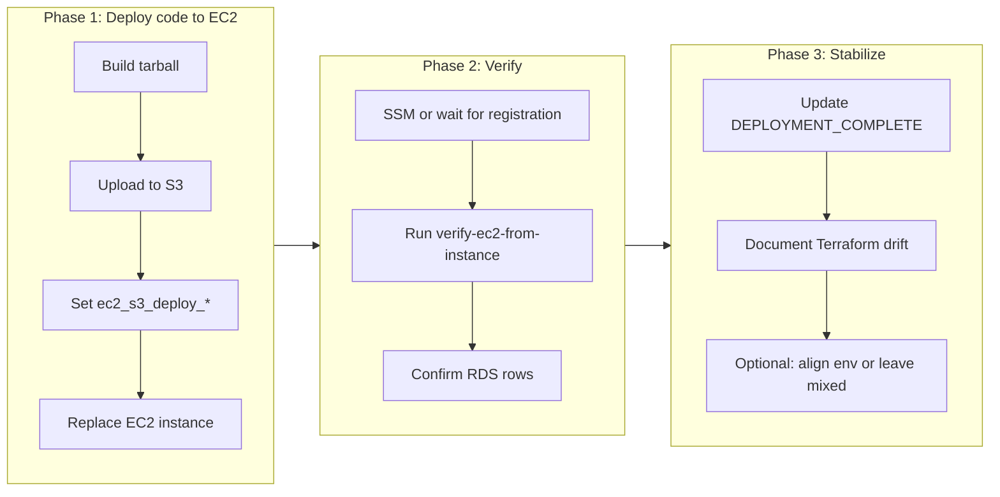

# Next Steps and Approach

## Current state (summary)

**Implemented and in Terraform state**

- **Lambda** generator, EventBridge schedule, IoT Core (things, certs, policies, rule).
- **RDS** with Secrets Manager; **RDS ingress rule** from EC2 security group (port 5432) in state.
- **EC2** instance `i-0d895184e87462efa` (scada-prod-mqtt-ingest) in prod VPC with: IAM (including `AmazonSSMManagedInstanceCore`), security group, user-data that:
  - Fetches IoT cert + private key from Secrets Manager (`scada-prod/ec2-iot-cert`).
  - Writes `/opt/scada/db.env` from RDS secret.
  - Uses `ExecStart=node dist/ec2/mqtt-to-rds-service.js` (with fallback to `src/` if `dist/` missing).
  - Supports optional S3 tarball or git clone via `repo_url`/`s3_deploy_*`.
- **VPC**: SSM, ec2messages, ssmmessages interface endpoints for Session Manager.
- **Scripts**: [scripts/verify-pipeline.sh](scripts/verify-pipeline.sh), [scripts/verify-ec2-from-instance.sh](scripts/verify-ec2-from-instance.sh), [scripts/build-and-pack-for-ec2.sh](scripts/build-and-pack-for-ec2.sh).
- **Docs**: [docs/MQTT_TO_RDS_ARCHITECTURE.md](docs/MQTT_TO_RDS_ARCHITECTURE.md) (verification, SSM, optional S3 deploy).

**Critical gap**

- [infrastructure/main.tf](infrastructure/main.tf) does **not** pass `repo_url`, `branch`, `ec2_s3_deploy_bucket`, or `ec2_s3_deploy_key` into the EC2 module (only `s3_deploy_bucket`/`s3_deploy_key` are passed; they default to `""`). So user-data on the **current** EC2 took the **else** branch in [infrastructure/modules/ec2/user-data.sh](infrastructure/modules/ec2/user-data.sh) (lines 27–29): it only created empty dirs (`src/ec2`, `certs`, `dist/ec2`). **No application code exists on the instance**; the service would fail or not start.

**Other gaps**

- **Terraform state drift**: State mixes dev and prod (e.g. some Lambda/CloudWatch/S3/IoT resources are `scada-dev-*`, while VPC/RDS/EC2/current IoT thing are prod). A full `terraform plan -var=environment=prod` shows **57 add, 15 change, 11 destroy**.
- **EC2 service unverified**: SSM did not show the instance as managed during our runs; we have not confirmed `systemctl status scada-mqtt-ingest` or RDS row counts from the instance.
- **DEPLOYMENT_COMPLETE.md** is stale (old instance ID, scada-dev focus, manual deploy steps that are partly superseded by user-data and Secrets Manager).
- **RDS verification** from a laptop is impossible (RDS in private VPC); it must be done from the EC2 instance (e.g. via SSM) using [scripts/verify-ec2-from-instance.sh](scripts/verify-ec2-from-instance.sh).

---

## Recommended approach

---

## Phase 1: Deploy application code to EC2 (priority)

**Goal**: Get the built Node app onto the EC2 instance so `scada-mqtt-ingest` can run and write to RDS.

**Option A – S3 deploy (recommended)**

1. **Build and upload**
  - Run `./scripts/build-and-pack-for-ec2.sh` (produces `scada-app.tar.gz`).
  - Choose or create an S3 bucket the EC2 role can access (when `ec2_s3_deploy_bucket` is set, the EC2 policy grants GetObject on that bucket).
  - Upload: `aws s3 cp scada-app.tar.gz s3://BUCKET/deploys/scada-app.tar.gz --region ap-south-1`.
2. **Terraform**
  - Add root-level variables if missing (already exist: [infrastructure/variables.tf](infrastructure/variables.tf) `ec2_s3_deploy_bucket`, `ec2_s3_deploy_key`).
  - Pass them into the EC2 module (already done in [infrastructure/main.tf](infrastructure/main.tf) lines 116–117).
  - Set values (e.g. in `terraform.tfvars` or `-var`):  
  `ec2_s3_deploy_bucket = "BUCKET"`, `ec2_s3_deploy_key = "deploys/scada-app.tar.gz"`.
3. **Replace instance** so user-data runs again with S3 path set:
  - `terraform taint module.ec2.aws_instance.mqtt_ingest`
  - `terraform apply -var=environment=prod` (with the new vars). Target the EC2 module if you want to limit scope.

**Option B – Git clone**

- Add variables (e.g. `ec2_repo_url`, `ec2_repo_branch`) and pass `repo_url` and `branch` from [infrastructure/main.tf](infrastructure/main.tf) into the EC2 module (module already supports them; see [infrastructure/modules/ec2/main.tf](infrastructure/modules/ec2/main.tf) variables and user-data).
- Set `repo_url` to the repo clone URL (HTTPS) and optionally `branch`.
- Taint and replace the EC2 instance so user-data clones, runs `npm run build`, and starts the service.

**Deliverable**: New EC2 instance with `/opt/scada` containing `dist/`, `node_modules/`, and `package.json`; user-data has already configured certs and `db.env`, so the service should start.

---

## Phase 2: Verify end-to-end pipeline

**Goal**: Confirm Lambda → IoT → EC2 → RDS and document how to re-run checks.

1. **Lambda**: From your machine, run `./scripts/verify-pipeline.sh` with `NAME_PREFIX=scada-prod` (or dev if that’s where the generator lives). Confirm Lambda log group and recent invocations (e.g. CloudWatch Logs for `scada-*-generator`).
2. **EC2 and RDS** (from inside VPC):
  - **SSM**: In AWS Console → Systems Manager → Fleet Manager, wait for the new instance to appear (VPC endpoints and IAM are already in place). Start a session.
  - **On the instance**: Run `sudo /opt/scada/scripts/verify-ec2-from-instance.sh scada-prod` (or copy the script if the tarball doesn’t include `scripts/`). This checks `systemctl status scada-mqtt-ingest`, journal logs, and RDS row counts (installs `postgresql15` if needed for `psql`).
  - If the instance never appears in SSM: document a fallback (e.g. bastion, or temporary key pair and SSH) to run the same commands.
3. **Success criteria**: Lambda publishing; EC2 service active; RDS tables (`devices`, `connections`, `telemetry`, `alerts`) with increasing row counts or recent timestamps.

**Deliverable**: A short runbook (e.g. in [docs/MQTT_TO_RDS_ARCHITECTURE.md](docs/MQTT_TO_RDS_ARCHITECTURE.md) or [DEPLOYMENT_COMPLETE.md](DEPLOYMENT_COMPLETE.md)): “How to verify the pipeline” (from laptop + from EC2 via SSM/script).

---

## Phase 3: Stabilize Terraform and documentation

**Goal**: Align docs with reality and make Terraform state vs. environment predictable.

1. **Update [DEPLOYMENT_COMPLETE.md**](DEPLOYMENT_COMPLETE.md)
  - Replace old instance ID and steps with: current prod instance (after replace), use of Secrets Manager for cert and DB, user-data behavior (S3 or repo), and verification via `verify-pipeline.sh` and `verify-ec2-from-instance.sh`.
  - Remove or qualify any “manual deploy” steps that are now handled by user-data.
2. **Terraform environment strategy** (choose one and document it)
  - **Option 1 – Full prod alignment**: Run `terraform apply -var=environment=prod` (no target) and accept 57 add / 11 destroy to make all resources `scada-prod-*`. Review plan carefully (e.g. Lambda/API Gateway/IoT renames and replacements) and ensure no critical resources are destroyed without replacement.
  - **Option 2 – Leave mixed state**: Keep using targeted applies for pipeline-related changes. Document in [infrastructure/README.md](infrastructure/README.md) or a small “OPERATIONS.md” that the state is intentionally dev+prod mixed and that `terraform plan -var=environment=prod` will show many changes unless targeting.
3. **Optional**: Add a single “source of truth” for the deploy bucket/key (e.g. `terraform.tfvars.example` with `ec2_s3_deploy_bucket` and `ec2_s3_deploy_key` commented) so future deploys are obvious.

**Deliverable**: DEPLOYMENT_COMPLETE (and optionally OPERATIONS.md) updated; Terraform strategy documented.

---

## Phase 4: Optional next steps (after pipeline is verified)

- **Grafana on AWS**: Connect Grafana to RDS in the cloud (e.g. Grafana on EC2/ECS with RDS as datasource, or Amazon Managed Grafana). Today Grafana in the repo is Docker/local only.
- **CI for S3 deploy**: GitHub Action (or similar) that on release/tag runs `build-and-pack-for-ec2.sh`, uploads to S3, and optionally updates a “latest” key or triggers instance refresh (e.g. SSM Run Command to pull new tarball and restart service).
- **E2E / smoke test**: Script or job that, with appropriate AWS credentials and network (e.g. from a runner in VPC or using SSM), checks Lambda logs, EC2 service status, and RDS row deltas to assert the pipeline is live.

---

## Implementation order (concise)

| Order | Task                                                                                                                                                 | Owner / note           |
| ----- | ---------------------------------------------------------------------------------------------------------------------------------------------------- | ---------------------- |
| 1     | Build tarball; choose S3 bucket; upload; set `ec2_s3_deploy_bucket` and `ec2_s3_deploy_key`; taint EC2 and apply (or set `repo_url` and taint/apply) | Deploy code to EC2     |
| 2     | Wait for SSM or use fallback; run `verify-ec2-from-instance.sh` on EC2; confirm service and RDS rows                                                 | Verify pipeline        |
| 3     | Update DEPLOYMENT_COMPLETE.md; document Terraform env strategy (full prod vs. mixed); optional tfvars.example                                        | Stabilize and document |
| 4     | (Optional) Grafana on AWS; CI for S3 deploy; e2e smoke test                                                                                          | Later improvements     |

---

## Risks and mitigations

- **SSM instance not showing**: VPC endpoints and IAM are correct; registration can be delayed or depend on agent restart. Mitigation: document bastion/SSH or “run these commands when you have shell” so verification is still possible.
- **Full Terraform apply**: Large plan with renames/destroys. Mitigation: Prefer targeted applies until you are ready to align; then run a full plan, review, and apply in a maintenance window.
- **RDS secret / DB_***: Already handled by user-data (`db.env` from RDS secret). No change needed unless you move to a different secret layout.

This plan gets the pipeline to a verified, documented state and then leaves clear optional paths for Grafana on AWS, CI, and testing.