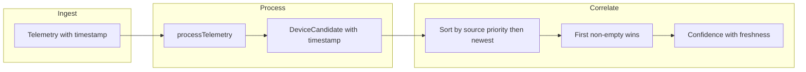

# Solution: Telemetry Freshness and Trust When Sources Disagree or Lag

## Problem in one sentence

Right now the correlator merges device candidates with **first-non-empty wins** and **fixed per-source confidence**, with **no use of telemetry age**—so stale or conflicting data can win by iteration order and there is no freshness-based trust.

## Solution in three parts

1. **Carry telemetry time into correlation** so each candidate has a timestamp.
2. **Resolve conflicts by policy** by sorting candidates by source priority and recency before merging, so the “winner” is deterministic and ICS-appropriate (e.g. SNMP preferred for identity, newest for volatile fields).
3. **Fold freshness into confidence** so older telemetry contributes less (or is ignored) and the overall trust score reflects how fresh and consistent the data is.

---

## 1. Attach timestamp to each candidate

**Where:** [src/lambda/process/handler.ts](src/lambda/process/handler.ts) (and any other callers that build `DeviceCandidate[]`), and the `DeviceCandidate` type in [src/processors/correlation/device-correlator.ts](src/processors/correlation/device-correlator.ts).

**What:** Add an optional `timestamp?: Date` to `DeviceCandidate`. When creating candidates in `processTelemetry()`, set `timestamp: telemetry.timestamp` (or `new Date(telemetry.timestamp)`) on every candidate. The correlator then has per-candidate age for sorting and for freshness scoring.

**Why:** Without this, the correlator cannot prefer “newer” over “older” or decay confidence by age.

---

## 2. Resolve conflicts: source priority + recency

**Where:** [src/processors/correlation/device-correlator.ts](src/processors/correlation/device-correlator.ts), inside `mergeCandidates()` (and optionally the loop that builds the merged device).

**Idea:** Before merging, **sort** the matched candidates so that:

- Higher-priority sources come first (e.g. SNMP > ARP > Syslog > NetFlow for device identity attributes like vendor, hostname, type).
- Within the same priority, **newest first** (using `candidate.timestamp`).

Then keep the current merge logic (“first non-empty wins”), but iteration order is now **deterministic and policy-driven**: e.g. SNMP wins over ARP for vendor; if two SNMP reports disagree, the newer one wins.

**Concrete steps:**

- Define a small config (or constant) **source priority order** for merging, e.g. `['snmp', 'arp', 'syslog', 'netflow']`.
- In `mergeAndCorrelate()`, before calling `mergeCandidates(matchedCandidates)`, sort `matchedCandidates`:
  - by index in that list (lower index = higher priority),
  - then by `timestamp` descending (newest first; treat missing timestamp as oldest).
- No change to the merge *algorithm* itself—only to the order of the array.

**Result:** When multiple sources disagree (e.g. different IP or hostname for the same device), the chosen value is the one from the highest-priority source that reported it; if the same source reported twice, the latest report wins. Different update rates are handled by “newest first” within a source tier.

---

## 3. Freshness-aware confidence (trust score)

**Where:** [src/processors/correlation/device-correlator.ts](src/processors/correlation/device-correlator.ts), in `calculateConfidence()` and optionally when building the merged candidate.

**Idea:** The overall confidence should drop when data is **old** or when there are **few recent** contributions. Two simple options:

- **Option A – Staleness cutoff:** If a candidate’s `timestamp` is older than a configured window (e.g. 10 or 15 minutes), either exclude it from the merge or give it zero weight in the confidence calculation. So “multiple sources” only counts recent sources.
- **Option B – Time decay:** Multiply each candidate’s contribution to the confidence by a factor that decays with age, e.g. `freshnessFactor = max(0, 1 - ageMinutes / stalenessMinutes)`. Then average or sum as today but with this weight.

**Concrete steps:**

- Add a **staleness window** (e.g. `STALENESS_MINUTES = 15`) as a constant or config.
- In `calculateConfidence()`:
  - Consider only candidates with `timestamp` within the last `STALENESS_MINUTES` (or treat missing timestamp as “old” and apply decay).
  - Optionally: `effectiveConfidence += baseConfidence * freshnessFactor` per candidate so that older telemetry reduces the total score.
- Optionally in `mergeCandidates()`: skip or down-rank candidates older than the window so stale data does not fill in attributes.

**Result:** Trust score reflects both “how many sources agree” and “how fresh the data is.” Fast-updating sources naturally contribute more than slow or stale ones; very old data does not drive the score or the merged view.

---

## 4. Optional: per-source last-seen and conflict alerts

- **Per-source last-seen:** Store in device metadata the last timestamp per source (e.g. `metadata.snmpLastSeen`, `metadata.arpLastSeen`). This helps dashboards and runbooks show “SNMP fresh, ARP stale” and can be used later for more advanced decay (e.g. decay a source’s weight if it hasn’t been seen for a while).
- **Conflict logging/alerting:** When merging, if two candidates from different sources provide **different non-empty values** for the same field (e.g. two different IPs for same MAC), log a conflict or emit a low-severity alert. That gives visibility without changing the merge rule (priority + recency still decides the value).

---

## Data flow (high level)

---

## Files to touch (summary)

| Area          | File                                                                                                                           | Change                                                                                                                   |
| ------------- | ------------------------------------------------------------------------------------------------------------------------------ | ------------------------------------------------------------------------------------------------------------------------ |
| Type          | [src/processors/correlation/device-correlator.ts](src/processors/correlation/device-correlator.ts)                             | Add `timestamp?` to `DeviceCandidate`; source-priority constant; sort before merge; freshness in `calculateConfidence()` |
| Process       | [src/lambda/process/handler.ts](src/lambda/process/handler.ts)                                                                 | Set `timestamp: telemetry.timestamp` on every candidate                                                                  |
| Other callers | [src/ec2/mqtt-to-rds-service.ts](src/ec2/mqtt-to-rds-service.ts), [src/simulator/mqtt-ingest.ts](src/simulator/mqtt-ingest.ts) | Pass or preserve timestamp when building candidates if they create `DeviceCandidate[]`                                   |
| Tests         | [tests/unit/processors/device-correlator.test.ts](tests/unit/processors/device-correlator.test.ts)                             | New cases: priority order wins; newer wins when same source; confidence drops with stale candidates                      |

---

## Configuration suggestion

- **Source priority for merge:** `['snmp', 'arp', 'syslog', 'netflow']` (SNMP highest; matches “prioritize SNMP” in existing tests).
- **Staleness window:** 10–15 minutes for typical ICS poll intervals; make this a config/env value so deployments can tune.

This gives you a clear solution: **telemetry freshness and trust are handled by attaching timestamps to candidates, sorting by source priority and recency before merge, and applying a staleness window or decay in the confidence score** so that when multiple sources disagree or update at different rates, the system behaves deterministically and reflects how fresh and consistent the data is.