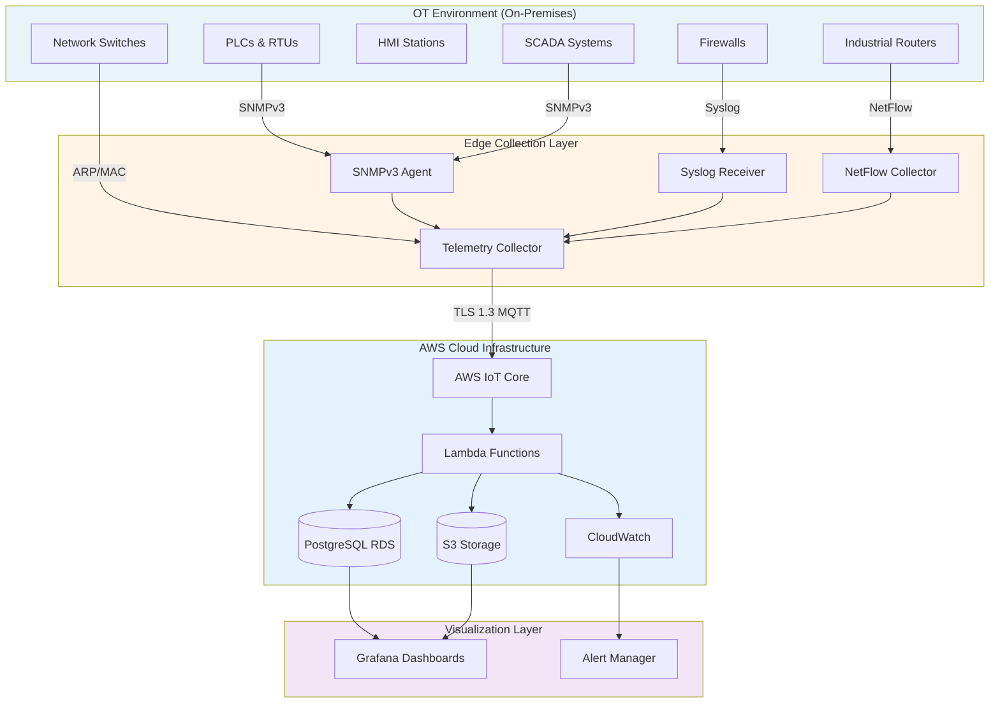
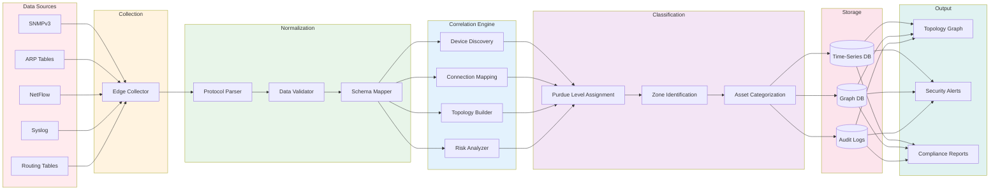
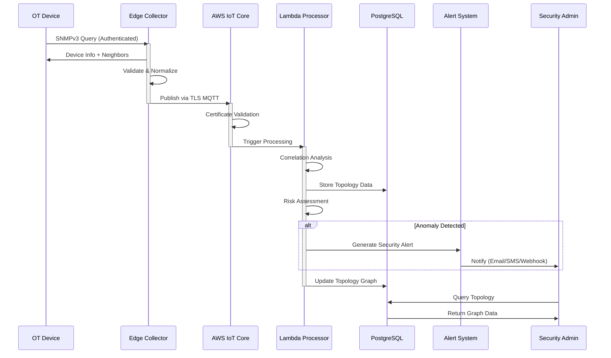
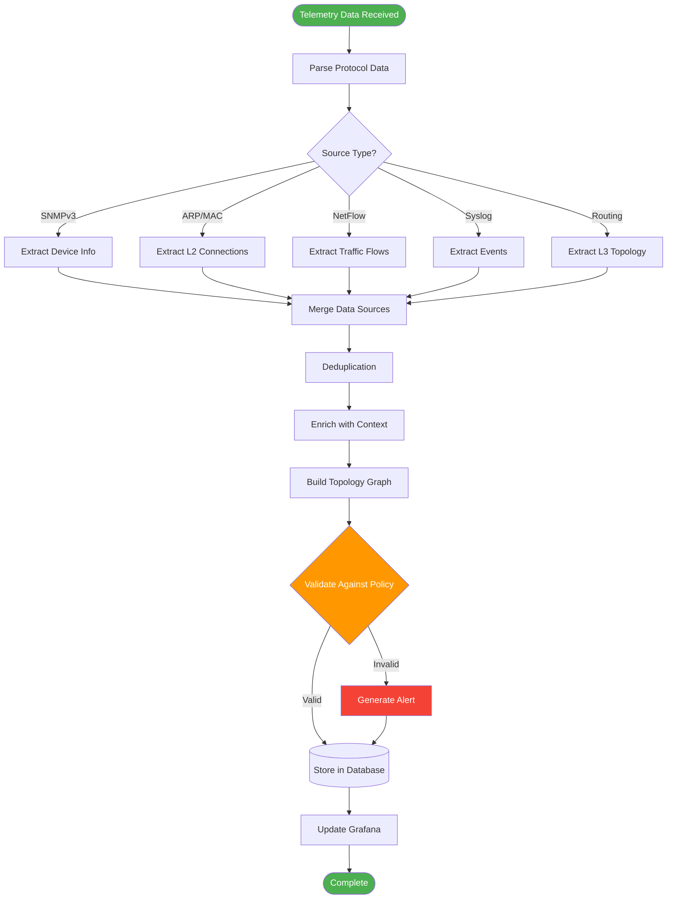

# Secure Automatic Network Topology Creation for SCADA/ICS

[](https://github.com)
[](https://github.com)
[](https://aws.amazon.com)
[](LICENSE)

> A secure, non-intrusive topology discovery and visibility system for industrial control networks, designed to eliminate OT blind spots and strengthen resilience in modern critical infrastructure.

## Overview

This project addresses the critical need for secure network visibility in industrial control systems (ICS) and SCADA environments. Inspired by the **2021 Oldsmar water treatment incident**, which exposed the severe risks of poor OT visibility and network segmentation, this system provides real-time topology discovery without disrupting critical operations.

Unlike traditional network discovery tools that rely on insecure protocols (CDP/LLDP), this solution uses **authenticated telemetry sources** to build a continuously updating, Purdue-model–aligned topology graph that maintains operational integrity while providing comprehensive visibility.

## Problem Statement

Modern industrial control networks face several critical challenges:

- **Limited Visibility**: Traditional IT monitoring tools are incompatible with OT environments
- **Insecure Discovery Protocols**: CDP/LLDP expose network topology to potential attackers
- **Air-Gapped Environments**: Isolated networks lack centralized monitoring capabilities
- **Compliance Requirements**: Regulatory frameworks demand comprehensive audit trails
- **Incident Response**: Lack of real-time topology data hampers forensic investigations

## Key Features

### Security-First Design
- **Zero-Trust Compatible**: No reliance on insecure discovery protocols
- **Authenticated Telemetry**: SNMPv3, TLS-secured MQTT, and encrypted data channels
- **Non-Intrusive**: Passive monitoring that doesn't disrupt control operations
- **IAM Integration**: Role-based access control aligned to industrial trust zones

### Real-Time Visibility
- **Live Topology Mapping**: Continuously updated network graph
- **Purdue Model Alignment**: Levels 0–5 with Industrial DMZ segmentation
- **Anomaly Detection**: Identifies intrusion paths and misconfigurations
- **Telemetry Correlation**: Combines multiple data sources for accurate topology

### Operational Excellence
- **Forensic-Ready**: Complete audit trails for incident response
- **Multi-Environment Support**: Works in isolated and semi-air-gapped networks
- **Serverless Architecture**: Scalable, cost-effective AWS infrastructure
- **Risk Classification**: Automated threat assessment and prioritization

## System Architecture

### High-Level Architecture



### Data Processing Pipeline



### Purdue Model Implementation

```mermaid
graph TB
    subgraph L5["Level 5: Enterprise Network"]
        ERP[ERP Systems]
        EMAIL[Email Servers]
        CORP[Corporate IT]
    end
    
    subgraph L4["Level 4: Site Business Planning"]
        MES[Manufacturing Execution Systems]
        HIST[Historians]
        REPORT[Reporting Systems]
    end
    
    subgraph DMZ["Industrial DMZ"]
        PROXY[Application Proxies]
        DIODE[Data Diodes]
        JUMP[Jump Servers]
    end
    
    subgraph L3["Level 3: Site Operations"]
        SCADA[SCADA Servers]
        HMI[HMI Systems]
        ENG[Engineering Workstations]
    end
    
    subgraph L2["Level 2: Area Supervisory"]
        SUPER[Supervisory Controllers]
        LOCAL[Local HMI]
        ALARM[Alarm Systems]
    end
    
    subgraph L1["Level 1: Basic Control"]
        PLC[PLCs]
        RTU[RTUs]
        DCS[DCS Controllers]
    end
    
    subgraph L0["Level 0: Process"]
        SENSOR[Sensors]
        ACTUATOR[Actuators]
        DRIVE[Variable Drives]
    end
    
    L5 <-->|Firewall| DMZ
    DMZ <-->|Firewall| L4
    L4 <-->|Firewall| L3
    L3 <-->|Firewall| L2
    L2 <-->|Industrial Switch| L1
    L1 <-->|I/O Network| L0
    
    style L5 fill:#1976d2,color:#fff
    style L4 fill:#1e88e5,color:#fff
    style DMZ fill:#ffa726,color:#000
    style L3 fill:#42a5f5,color:#fff
    style L2 fill:#66bb6a,color:#fff
    style L1 fill:#9ccc65,color:#000
    style L0 fill:#d4e157,color:#000
```



### Security Workflow



### Telemetry Correlation Process



## Technology Stack

| Component | Technology | Purpose |
|-----------|-----------|---------|
| **Data Ingestion** | AWS IoT Core + MQTT | TLS-secured telemetry collection |
| **Processing** | AWS Lambda | Serverless event-driven processing |
| **Storage** | PostgreSQL RDS | Telemetry storage and risk classification |
| **Visualization** | Grafana Node Graph | Live topology and telemetry dashboards |
| **Security** | AWS IAM + KMS | Access control and encryption |
| **Monitoring** | CloudWatch | System health and alerting |

### Data Sources

The system correlates multiple authenticated telemetry sources:

1. **SNMPv3**: Secure device information and status monitoring
2. **ARP/MAC Tables**: Layer 2 connectivity and device discovery
3. **NetFlow**: Traffic patterns and communication flows
4. **Syslog**: Security events and system logs
5. **Routing Intelligence**: Layer 3 topology and path analysis

## Key Outcomes

### Security Improvements
- **Zero-Trust Compatibility**: Eliminates reliance on insecure discovery protocols
- **Encrypted Communications**: All data in transit protected by TLS 1.3
- **Intrusion Detection**: Real-time identification of unauthorized connections
- **Compliance Ready**: Meets NERC CIP, IEC 62443, and NIST standards

### Operational Benefits
- **Real-Time Visibility**: Sub-minute topology updates
- **Purdue Model Alignment**: Clear segmentation across all levels (0–5)
- **Misconfiguration Detection**: Automated identification of policy violations
- **Forensic Capabilities**: Complete audit trails for incident response

### Business Value
- **Reduced Downtime**: Faster incident response and troubleshooting
- **Scalability**: Serverless architecture grows with your infrastructure
- **Multi-Site Support**: Centralized visibility across distributed facilities
- **Air-Gap Compatible**: Works in isolated industrial environments

## Getting Started

### Prerequisites

- AWS Account with appropriate IAM permissions
- PostgreSQL 13+ (or AWS RDS)
- Grafana 9.0+
- Network access to OT devices (SNMPv3, Syslog, NetFlow)
- TLS certificates for MQTT communication

### Installation

```bash
# Clone the repository
git clone https://github.com/yourusername/scada-topology-discovery.git
cd scada-topology-discovery

# Install dependencies
npm install

# Configure AWS credentials
aws configure

# Deploy infrastructure
./scripts/deploy-infrastructure.sh

# Configure telemetry sources
./scripts/configure-collectors.sh
```

### Configuration

1. **AWS IoT Core Setup**
   ```bash
   # Create IoT thing and certificates
   aws iot create-thing --thing-name scada-collector-01
   ```

2. **Database Initialization**
   ```bash
   # Run database migrations
   npm run migrate
   ```

3. **Grafana Dashboard Import**
   - Import dashboards from `grafana/dashboards/`
   - Configure PostgreSQL data source
   - Set up alerting rules

### Quick Start

```bash
# Start the telemetry collector
npm run collector:start

# Deploy Lambda functions
npm run deploy:lambda

# Launch Grafana dashboard
npm run grafana:start
```

## Purdue Model Classification

The system automatically classifies devices into Purdue Model levels:

| Level | Description | Examples | Security Zones |
|-------|-------------|----------|----------------|
| **Level 0** | Field Devices | Sensors, Actuators, PLCs | Process Zone |
| **Level 1** | Control Devices | RTUs, Local Controllers | Basic Control Zone |
| **Level 2** | Supervisory | SCADA, HMI Systems | Supervisory Zone |
| **Level 3** | Operations | MES, Historians | Operations Zone |
| **Level 4** | Enterprise | ERP, Business Systems | Enterprise Zone |
| **DMZ** | Industrial DMZ | Data Diodes, Proxies | Demilitarized Zone |

## Security Features

### Authentication & Authorization
- SNMPv3 with authentication and privacy
- TLS 1.3 for all MQTT communications
- AWS IAM roles with least-privilege access
- Certificate-based device authentication

### Data Protection
- Encryption at rest (AWS KMS)
- Encryption in transit (TLS 1.3)
- Secure credential storage (AWS Secrets Manager)
- Network segmentation enforcement

### Monitoring & Alerting
- Real-time anomaly detection
- Automated security alerts
- Comprehensive audit logging
- Forensic data retention

## Use Cases

### 1. Incident Response
Rapidly identify affected systems and communication paths during security incidents.

### 2. Compliance Auditing
Generate topology reports demonstrating proper network segmentation for regulatory compliance.

### 3. Change Management
Visualize network changes before and after maintenance windows to ensure proper configuration.

### 4. Threat Hunting
Identify unauthorized connections and anomalous communication patterns in real-time.

### 5. Capacity Planning
Analyze network utilization and plan infrastructure upgrades based on actual traffic patterns.

## Development

### Project Structure

```
.
├── src/
│   ├── collectors/          # Telemetry collection agents
│   ├── lambda/              # AWS Lambda functions
│   ├── processors/          # Data correlation engine
│   └── utils/               # Shared utilities
├── infrastructure/          # AWS CloudFormation/Terraform
├── grafana/
│   ├── dashboards/          # Pre-built dashboards
│   └── alerts/              # Alert configurations
├── database/
│   ├── migrations/          # Database schema
│   └── seeds/               # Sample data
├── docs/                    # Documentation
└── tests/                   # Test suites
```

### Running Tests

```bash
# Unit tests
npm run test:unit

# Integration tests
npm run test:integration

# Security tests
npm run test:security
```

## Documentation

- [Architecture Deep Dive](docs/architecture.md)
- [Deployment Guide](docs/deployment.md)
- [Security Hardening](docs/security.md)
- [Troubleshooting](docs/troubleshooting.md)
- [API Reference](docs/api.md)

## Contributing

Contributions are welcome! Please read our [Contributing Guidelines](CONTRIBUTING.md) before submitting pull requests.

### Development Workflow

1. Fork the repository
2. Create a feature branch (`git checkout -b feature/amazing-feature`)
3. Commit your changes (`git commit -m 'Add amazing feature'`)
4. Push to the branch (`git push origin feature/amazing-feature`)
5. Open a Pull Request

## License

This project is licensed under the MIT License - see the [LICENSE](LICENSE) file for details.

## Acknowledgments

- Inspired by lessons learned from the 2021 Oldsmar water treatment incident
- Built on industry standards: IEC 62443, NERC CIP, NIST Cybersecurity Framework
- Thanks to the OT security community for continuous feedback and improvements

## Contact & Support

- **Project Lead**: [Your Name](mailto:your.email@example.com)
- **Issues**: [GitHub Issues](https://github.com/yourusername/scada-topology-discovery/issues)
- **Discussions**: [GitHub Discussions](https://github.com/yourusername/scada-topology-discovery/discussions)

## Related Projects

- [SCADA Security Tools](https://github.com/topics/scada-security)
- [ICS Security Resources](https://github.com/topics/ics-security)
- [Industrial IoT Platforms](https://github.com/topics/industrial-iot)

---

**Security Notice**: This system is designed for authorized use in industrial environments. Ensure proper authorization before deploying in production networks. Always follow your organization's security policies and regulatory requirements.

**Built for Critical Infrastructure Protection**
